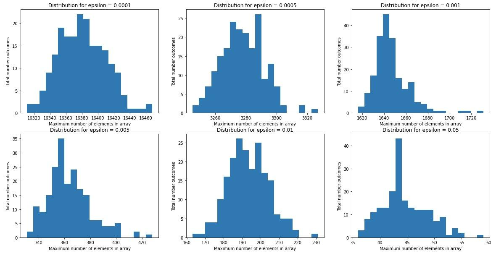

# Assignment 1 for STDSR, Nikita Tihonov, DS18-01

This project contains Python implementation for GK01 algorithm (from M. Greenwald S. Khanna paper)

## Testing of space complexity

To prove that worst space complexity of GK01 algorithm is $O(\frac{1}{\epsilon}\log(\epsilon N)$, I ran algorithm with different values of $\epsilon$ over the same dataset (numbers from 0 to 99999) 200 times, but each time it was shuffled randomly. Each time I saved the max value of the worst number of elements in the list of tuples. As a result, I got the following distributions of maximum length of list of tuples:

## References
1. Greenwald, M., & Khanna, S. (2001). Space-efficient online computation of quantile summaries. ACM SIGMOD Record, 30(2), 58-66.